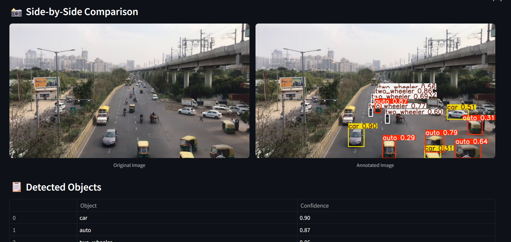

# 🚦 Real-Time Object Detection System using YOLOv8

This project is a real-time object detection system that can annotate images, videos, and live webcam feeds using a YOLOv8 model. It supports object classes: **Car**, **Two-wheeler**, and **Autorickshaw**. The project is built using **Streamlit** for the UI and **Ultralytics YOLOv8** for object detection.

---

## 📋 Features

- 🎯 **Image Annotation**  
  Upload an image and get annotated output with bounding boxes and confidence scores displayed in a table.

- 🎮 **Video Annotation**  
  Upload a video, annotate every frame using the YOLOv8 model, and preview the result directly in the app.

- 📡 **Live Camera Annotation**  
  Use your device's webcam to detect and annotate objects in real-time.

---

## 📁 File Structure

```
Object-Detection-System/
│
├── model/
│   └── best.pt                  # Trained YOLOv8 model with 3 classes
│
├── output/
│   └── annotated_video.mp4      # Processed video output
├── utils/
│   └── image_utils.py           # Process and annotate images  
│   └── live_utils.py            # Process and annotate videos
│   └── video_utils.py           # Live Processing and annotation
├── app.py                       # Main Streamlit application
├── README.md                    # Project documentation
└── requirements.txt             # Python dependencies
```

---

## ✅ Requirements

- Python 3.8+
- Streamlit
- OpenCV
- Ultralytics YOLOv8
- ffmpeg (installed and accessible via PATH)

Install dependencies:
```bash
pip install -r requirements.txt
```

---

## 🚀 Run the App Locally

```bash
streamlit run app.py
```

Make sure your webcam is accessible and your `best.pt` model file is placed inside the `model/` directory.

---

## 🌐 Deployment

You can deploy this app on:
- **Streamlit Cloud** (requires webcam permissions)
- **Local Network** (to access from your phone/laptop)

### ⚠️ Live Camera Notes:
- Live camera will work **only on the device** where the app is running (due to browser security limitations).
- On mobile, if you deploy via local network, the mobile browser must support webcam access.

---

## 🏋️‍♂️ Dataset Info

- **Size:** 100+ RGB images manually labeled
- **Classes:** `car`, `two_wheeler`, `autorickshaw`
- **Format:** YOLOv8 `.txt` label files
- **Annotation Tool:** LabelImg

The dataset was built by collecting traffic scene images from public sources. Each image was manually annotated using the LabelImg tool and split into `train/val` sets.

---

## 📊 Model Info & Training

- **Model:** YOLOv8n (Ultralytics)
- **Why YOLOv8?**
  - Lightweight and fast
  - Easy to fine-tune on custom data
  - Ideal for real-time detection with good accuracy

### Training Command:
```python
from ultralytics import YOLO
model = YOLO("yolov8n.pt")
model.train(data="yolov8_config.yaml", epochs=100, imgsz=640)
```

---

## ⚖️ Challenges & Solutions

| Challenge | Solution |
|----------|----------|
| Streamlit camera stream issues | Managed session state for live tab |
| Torch runtime error in Streamlit | Patched `torch.classes.__path__` with dummy class |
| Small dataset size | increased training epochs |
| Git warnings on line endings | Ignored harmless CRLF/LF warnings |


---

## 📊 Performance Metrics

| Metric        | Value    |
|---------------|----------|
| **mAP@0.5**      | 0.6869   |
| **mAP@0.5:0.95** | 0.4228   |
| Precision     | 0.6483   |
| Recall        | 0.7503   |

Evaluation was done on the validation set using the `model.val()` method. These results show strong performance for car and auto detection, with potential for improvement on two-wheelers with more training data.

---

## 📊 Output Example

### Image Tab:
- Annotated image preview
- Table of detected objects with confidence values

| Object       | Confidence |
|--------------|------------|
| car          | 0.87       |
| two_wheeler  | 0.79       |

### Video Tab:
- Processed video preview in a compact video player
- Supports `.mp4`, `.avi`, `.mov`

---
## 📸 Screenshots

### 1. Image Annotation  


### 2. Video Annotation  

#### 🎬 Watch Video Output
[▶️ Click to view sample video](data/screenshots/annotated_video.mp4)

<!-- ### 3. Live Detection  
 -->

---

## 🔧 Future Improvements

- Add bounding box coordinates to the table
- Improve model generalization by expanding the dataset
- Deploy to HuggingFace or Streamlit Cloud with webcam support

---

## ✔️ Scope Covered

✔ Image upload + annotation  
✔ Video upload + annotation + inline preview  
✔ Live camera real-time detection  
✔ Display detected class + confidence  
✔ Streamlit UI with tabs for clear separation  
✔ Compact embedded video player  
✔ Model trained and integrated successfully

---

## 🙏 Acknowledgments

- [Ultralytics YOLOv8](https://docs.ultralytics.com)
- [Streamlit](https://streamlit.io)
- [OpenCV](https://opencv.org)
